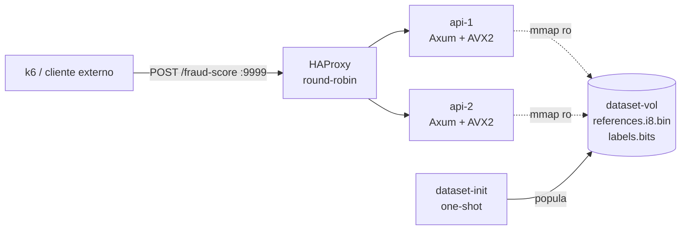

# Rinha de Backend 2026 — Submissão Rust (Satake)

Detecção de fraude por busca vetorial em Rust. Para cada `POST /fraud-score`, o
backend transforma o payload em um vetor de 14 dimensões `i8`, executa um k-NN
exato (k=5, distância euclidiana ao quadrado) por scan linear vetorizado com
AVX2 sobre 3.000.000 de vetores e devolve a decisão `{ approved, fraud_score }`.

A enunciação completa do desafio está em [PROMPT.md](./PROMPT.md) e nos
documentos de referência ([API.md](./API.md), [REGRAS_DE_DETECCAO.md](./REGRAS_DE_DETECCAO.md),
[ARQUITETURA.md](./ARQUITETURA.md), [DATASET.md](./DATASET.md),
[AVALIACAO.md](./AVALIACAO.md), [SUBMISSAO.md](./SUBMISSAO.md),
[FAQ.md](./FAQ.md)).

## Topologia



- `lb` (HAProxy 2.9, alpine) — único ponto exposto na porta `9999`. Round-robin
  puro, sem inspecionar payload.
- `api-1`, `api-2` — duas instâncias idênticas do binário Rust em
  `gcr.io/distroless/cc-debian12`. Cada uma roda Tokio `current_thread` e o scan
  AVX2 inline na própria task da request.
- `dataset-init` — serviço one-shot que copia `references.i8.bin` (48 MB) e
  `labels.bits` (375 KB) para o volume `dataset-vol`, montado read-only nas
  duas APIs. Os artefatos são gerados em build-time pelo estágio `dataset` do
  Dockerfile, a partir de `resources/references.json.gz`.
- Limites totais: **1.00 CPU / 350 MB** (`lb 0.10/30 MB` + `api-* 0.45/160 MB`
  cada), dentro do orçamento da Rinha.

## Estratégia em uma linha

k-NN exato (k=5, L2² euclidiano) por scan linear AVX2 sobre 3M de vetores `i8`
quantizados em `[0,100]`, single-thread por instância, com Tokio `current_thread`
e top-5 em buffer fixo na pilha — sem `rayon`, sem `BinaryHeap`, sem ANN.

Detalhes técnicos: [tasks/prd-rinha-backend-2026/techspec.md](./tasks/prd-rinha-backend-2026/techspec.md).

## Como rodar

### Pré-requisitos

- Docker 24+ com `buildx` habilitado (já vem no Docker Desktop).
- Para mantenedores em **Apple Silicon (M1/M2/M3/M4)**: o build precisa
  forçar a arquitetura amd64, porque o binário usa `target-cpu=x86-64-v3`
  (AVX2/FMA) e o ambiente oficial da Rinha é um Mac Mini Late 2014 (Haswell).

### Build e execução completos (a partir do código-fonte)

```bash
# Apple Silicon: força linux/amd64 para todos os estágios do Dockerfile.
docker buildx build --platform linux/amd64 --load -t rinha-api:local --target runtime .
docker buildx build --platform linux/amd64 --load -t rinha-dataset:local --target dataset .

# Sobe a stack (lb + api-1 + api-2 + dataset-init).
docker compose up
```

> **Apple Silicon — atenção:** sem `--platform linux/amd64`, a imagem builda
> para `linux/arm64` e o binário emitido com `target-cpu=x86-64-v3` falha em
> runtime. O Dockerfile já fixa `--platform=linux/amd64` em todos os `FROM`,
> e `docker buildx build --platform linux/amd64` garante que o cross-compile
> ocorre via QEMU.

Após `docker compose up`, valide manualmente:

```bash
# /ready deve responder 200 quando os artefatos terminarem de carregar.
curl -fsS http://localhost:9999/ready

# /fraud-score com payload de exemplo (ver API.md).
curl -fsS -X POST http://localhost:9999/fraud-score \
    -H 'content-type: application/json' \
    --data @resources/sample-request.json
```

### Build local (sem Docker, para iteração rápida)

```bash
# Toolchain pinada em rust-toolchain.toml (estável 1.85, edição 2024).
cargo build --release

# Gera os artefatos binários em ./target/dataset/
cargo run --release --bin build-dataset -- \
    resources/references.json.gz target/dataset

# Sobe a API apontando para os artefatos locais.
RINHA_REFS=target/dataset/references.i8.bin \
RINHA_LABELS=target/dataset/labels.bits \
RINHA_NORMALIZATION=resources/normalization.json \
RINHA_MCC_RISK=resources/mcc_risk.json \
RINHA_BIND=0.0.0.0:8080 \
    cargo run --release --bin api
```

### Testes

```bash
cargo test                          # unidade + integração
cargo clippy --all-targets -- -D warnings
cargo fmt --all -- --check
```

## Estrutura de diretórios

```
.
├── crates/
│   ├── shared/          # vetorização, normalização, quantização, formato binário
│   ├── build-dataset/   # binário offline: references.json.gz → references.i8.bin + labels.bits
│   └── api/             # Axum + scan AVX2 + handlers /ready e /fraud-score
├── infra/
│   └── haproxy/
│       └── haproxy.cfg  # frontend :9999 → backend roundrobin api-1/api-2
├── resources/           # references.json.gz, mcc_risk.json, normalization.json (entradas do build)
├── tasks/               # PRD, Tech Spec e tasks da implementação
├── Cargo.toml           # workspace
├── Dockerfile           # multi-stage: builder → dataset → runtime (distroless)
├── docker-compose.yml   # lb + api-1 + api-2 + dataset-init (build a partir do Dockerfile)
├── info.json            # metadados da submissão
└── README.md            # este arquivo
```

## Branches

- `main` — código-fonte completo (este conteúdo).
- `submission` — apenas `docker-compose.yml` + `info.json`. O compose dessa
  branch puxa imagens públicas do GHCR (sem necessidade de código-fonte local)
  e é o que a engine da Rinha consome via issue `rinha/test`.

## Submissão e teste oficial

1. Publicar as imagens no GHCR (uma vez, e a cada release):

   ```bash
   docker buildx build --platform linux/amd64 --push \
       -t ghcr.io/satakedev/rinha-api:latest --target runtime .
   docker buildx build --platform linux/amd64 --push \
       -t ghcr.io/satakedev/rinha-dataset:latest --target dataset .
   ```

2. `git push origin main submission` — garantir que ambas as branches estão
   públicas e atualizadas.
3. Abrir uma issue no repositório com `rinha/test` na descrição. A engine
   detecta a issue, sobe a stack a partir da branch `submission`, executa o
   teste de prévia/final, comenta o resultado e fecha a issue.

Detalhes do fluxo: [SUBMISSAO.md](./SUBMISSAO.md).
